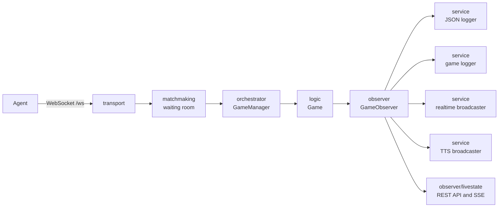

# About the Architecture

[architecture in Japanese](/doc/ja/architecture.md)

This document describes the internal structure of the server and its extension points.
For the rules of the game itself, please refer to [Game Logic Implementation](/doc/en/logic.md).

## Overview

The server runs with one configuration file per process.
Agents connect over WebSocket, and a game is created once the required number of agents has gathered.
Multiple games proceed concurrently within a single process.



## Package Layout

| Package | Responsibility |
| --- | --- |
| `transport` | Accepting WebSocket connections, HTTP router, REST API, token verification, signal handling |
| `orchestrator` | `GameManager`. Handles creation and disposal of games once matching succeeds |
| `matchmaking` | Waiting room, match optimizer, analysis and reduction of match history |
| `logic` | Game logic. Day progression, each phase, aggregation and limiting of speeches |
| `model` | Data structures such as configuration, packets, and agents |
| `observer` | The interface for game event notification and the shared broadcasting implementation |
| `service` | Implementations of observer. JSON logging, game logging, realtime broadcasting, TTS broadcasting |
| `store` | Persistence of the match optimizer state |
| `util` | Helper functions for authentication, length counting, profile generation, and so on |

The direction of dependency is `transport` → `orchestrator` → `logic` → `observer` → `model`.
`model` depends on no other package, and `observer` depends only on `model`.

## From Startup to a Game

1. `main.go` loads `.env`. Development builds (such as `go run`, where version information is not embedded) read `./config/.env`, while release builds read `./.env`.
2. It loads the configuration file specified by `-c` and applies the environment variable overrides.
3. `transport.NewServer` builds each sink (loggers and broadcasters) and the `GameManager` according to the configuration.
4. When an agent connects to `/ws`, the server obtains its name via a `NAME` request and registers it in the waiting room, using the name without its trailing digits as the team name.
5. Once the required number of agents has gathered, `GameManager` creates a `logic.Game` and runs it in a dedicated goroutine.
6. When the game finishes, it is removed from the registry and the connections are closed.

Upon receiving `SIGTERM` / `SIGINT` / `SIGHUP`, the server stops accepting new connections and exits after all games in progress have finished.
During this period, `GET /api/v1/readyz` returns `503`.

## Matching

- When `matching.self_match` is `true`, only agents with the same team name are matched. This is the default for development.
- When it is `false`, agents with different team names are matched.
- When `matching.is_optimize` is additionally `true`, a match schedule is created in advance so that the combinations of teams and roles are balanced. The progress is saved to `matching.output_path`, so the schedule resumes even after the process is restarted.

Use `-a` (analysis mode) to aggregate the match schedule, and `-r` / `-s` / `-d` (reduction mode) to reduce it.

## Game Progression

`logic.Game` executes the configured day and night section phases in order.
The phase composition is defined by `logic.day_phases` / `logic.night_phases` in the configuration file, and corresponds to the `talk` / `whisper` / `execution` / `divine` / `guard` / `attack` actions.

The communication mode for talk and whisper branches on whether `duration` is set.

- Without `duration`: turn-based mode (`logic/communication_turn.go`)
- With `duration`: group chat mode (`logic/communication_freeform.go`)

In both modes, the validation of speech count, length, and skip count is shared in `logic/communication_session.go`.

## Output via Observers

`logic` does not touch files or HTTP directly; it notifies semantic events to `observer.GameObserver`.
Formatting such as CSV layout and broadcast packet assembly is entirely the responsibility of the sinks.

`transport.Server.newObserver` gathers the enabled sinks according to the configuration, combines them into one with `observer.NewComposite`, and passes it to the game.

| Sink | Output | Configuration |
| --- | --- | --- |
| `service.JSONLogger` | JSON log of the communication between the server and agents | `json_logger` |
| `service.GameLogger` | Game log compatible with the previous game server | `game_logger` |
| `service.RealtimeBroadcaster` | JSONL file for realtime broadcasting | `realtime_broadcaster` |
| `service.TTSBroadcaster` | Audio segments generated by VOICEVOX | `tts_broadcaster` |
| `observer/livestate.LiveState` | Current state for the REST API and SSE | Always enabled |

To add an output, implement `observer.GameObserver` and register it in `newObserver`.
Embedding `observer.NoopObserver` lets you implement only the events you need.

## Types for Immutability

Values passed to observers and the REST API are converted into read-only view types that cannot reach internal state.

- `model.AgentView` / `model.TalkView`: representations of agents and speeches that do not contain `Connection` or channels
- `model.GameSnapshot`: the value-type snapshot returned by `GameManager` and the API
- `model.RulesetView` / `model.SettingView`: getter-only interfaces. Each game holds its own copy, so the configuration never changes after a game starts

## Environment Variables

The following can be specified in `.env` or in the process environment.

| Environment Variable | Purpose |
| --- | --- |
| `SECRET_KEY` | The secret key for token verification when `server.authentication.enable` is `true` |
| `OPENAI_API_KEY` | The ChatGPT API key used when `custom_profile.dynamic_profile.enable` is `true` |
| `HOST` | Overrides `server.web_socket.host` |
| `PORT` | Overrides `server.web_socket.port` |

`HOST` and `PORT` exist so that the listening address can be changed for container execution without editing the configuration file.
When they are not set, the values from the configuration file are used.

## Docker

The `Dockerfile` places a statically linked binary built with CGO disabled into a distroless image.
Since `config/*.yml` is bundled, the image can be started on its own.

```bash
docker compose up --build
```

`docker-compose.yml` mounts `./config` and `./log`, and specifies `HOST` / `PORT` through environment variables.
To use TTS, uncomment the `voicevox` service and set `tts_broadcaster.host` in the configuration file to `http://voicevox:50021`.
Since the image does not include ffmpeg, you need to build a separate image that contains it when using TTS.

## Testing

The files under `test/` are integration tests that actually start the server, connect `TestClient` instances, and play through a full game.
They use the configurations in `test/config/*.yml`, and the port is assigned by searching for a free one in the range 49152–65535.

```bash
go test -race ./...
```
