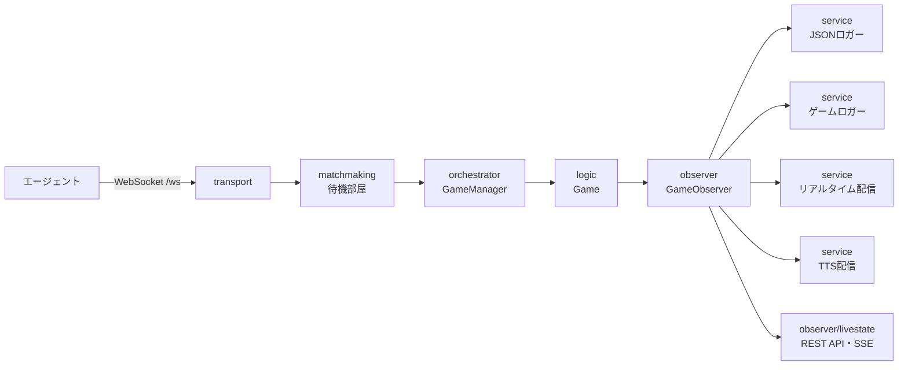

# アーキテクチャについて

[architecture in English](/doc/en/architecture.md)

このドキュメントでは、サーバの内部構成と拡張点について説明します。\
ゲームのルールそのものについては [ゲームロジックの実装について](/doc/ja/logic.md) を参照してください。

## 全体像

サーバは1プロセスにつき1つの設定ファイルで動作します。\
エージェントは WebSocket で接続し、必要な人数が揃った時点でゲームが生成されます。\
1つのプロセスで複数のゲームが並行して進行します。



## パッケージ構成

| パッケージ | 責務 |
| --- | --- |
| `transport` | WebSocket 接続の受付、HTTP ルータ、REST API、トークン検証、シグナル処理 |
| `orchestrator` | `GameManager`。マッチング成立からゲームの生成・破棄までを担う |
| `matchmaking` | 待機部屋、マッチオプティマイザ、マッチ履歴の解析・縮約 |
| `logic` | ゲームロジック。日付進行、各フェーズ、発言の集約と制限 |
| `model` | 設定・パケット・エージェント等のデータ構造 |
| `observer` | ゲームイベントの通知インターフェースと配信の共通実装 |
| `service` | observer の実装。JSON ログ、ゲームログ、リアルタイム配信、TTS 配信 |
| `store` | マッチオプティマイザの状態の永続化 |
| `util` | 認証、文字数カウント、プロフィール生成などの補助関数 |

依存の向きは `transport` → `orchestrator` → `logic` → `observer` → `model` です。\
`model` は他のどのパッケージにも依存せず、`observer` は `model` のみに依存します。

## 起動から対戦までの流れ

1. `main.go` が `.env` を読み込みます。開発ビルド (`go run` など、バージョン情報が埋め込まれていない場合) は `./config/.env` を、リリースビルドは `./.env` を参照します。
2. `-c` で指定された設定ファイルを読み込み、環境変数による上書きを適用します。
3. `transport.NewServer` が設定に応じて各 sink (ロガー・ブロードキャスタ) と `GameManager` を構築します。
4. エージェントが `/ws` に接続すると、`NAME` リクエストで名前を取得し、末尾の数字を除いた部分をチーム名として待機部屋に登録します。
5. 必要な人数が揃うと `GameManager` が `logic.Game` を生成し、専用の goroutine で進行させます。
6. ゲームが終了すると登録簿から取り除かれ、接続は切断されます。

`SIGTERM` / `SIGINT` / `SIGHUP` を受信すると新規接続の受付を停止し、進行中のゲームがすべて終了するまで待ってから終了します。\
この間 `GET /api/v1/readyz` は `503` を返します。

## マッチング

- `matching.self_match` が `true` の場合、同じチーム名のエージェントのみでマッチングします。開発時の既定です。
- `false` の場合は異なるチーム名のエージェント同士をマッチングします。
- さらに `matching.is_optimize` が `true` の場合は、チームと役職の組み合わせが均等になるよう事前に対戦表を作成します。進捗は `matching.output_path` に保存され、プロセスを再起動しても続きから実行されます。

対戦表の集計には `-a` (解析モード)、縮約には `-r` / `-s` / `-d` (縮約モード) を使用します。

## ゲームの進行

`logic.Game` は設定された昼セクションと夜セクションのフェーズを順に実行します。\
フェーズの構成は設定ファイルの `logic.day_phases` / `logic.night_phases` で定義され、`talk` / `whisper` / `execution` / `divine` / `guard` / `attack` のアクションに対応します。

トークと囁きの通信方式は、設定の `duration` の有無で分岐します。

- `duration` なし: ターンベース方式 (`logic/communication_turn.go`)
- `duration` あり: グループチャット方式 (`logic/communication_freeform.go`)

いずれの方式でも、発言回数・文字数・スキップ回数の検証は `logic/communication_session.go` に共通化されています。

## observer による出力

`logic` はファイルや HTTP を直接操作せず、`observer.GameObserver` にセマンティックなイベントを通知します。\
CSV 書式やブロードキャストパケットの組み立てといった整形は、すべて sink 側の責務です。

`transport.Server.newObserver` が設定に応じて有効な sink を集め、`observer.NewComposite` で1つにまとめてゲームへ渡します。

| sink | 出力先 | 設定 |
| --- | --- | --- |
| `service.JSONLogger` | サーバとエージェントの通信の JSON ログ | `json_logger` |
| `service.GameLogger` | 従来のゲームサーバと互換のゲームログ | `game_logger` |
| `service.RealtimeBroadcaster` | リアルタイム配信用の JSONL ファイル | `realtime_broadcaster` |
| `service.TTSBroadcaster` | VOICEVOX による音声セグメント | `tts_broadcaster` |
| `observer/livestate.LiveState` | REST API と SSE のための現在状態 | 常に有効 |

出力を追加する場合は `observer.GameObserver` を実装し、`newObserver` に登録します。\
`observer.NoopObserver` を埋め込めば、必要なイベントだけを実装できます。

## 不変性のための型

observer や REST API へ渡す値は、内部状態へ到達できない読み取り専用のビュー型に変換します。

- `model.AgentView` / `model.TalkView`: `Connection` やチャネルを含まないエージェント・発言の表現
- `model.GameSnapshot`: `GameManager` と API が返す値型のスナップショット
- `model.RulesetView` / `model.SettingView`: getter のみのインターフェース。ゲームは自身のコピーを保持するため、開始後に設定が変わることはありません

## 環境変数

`.env` もしくはプロセスの環境変数で以下を指定できます。

| 環境変数 | 用途 |
| --- | --- |
| `SECRET_KEY` | `server.authentication.enable` が `true` の場合のトークン検証の秘密鍵 |
| `OPENAI_API_KEY` | `custom_profile.dynamic_profile.enable` が `true` の場合の ChatGPT の API キー |
| `HOST` | `server.web_socket.host` の上書き |
| `PORT` | `server.web_socket.port` の上書き |

`HOST` と `PORT` は、設定ファイルを編集せずにコンテナ実行時のみ待ち受けアドレスを変えるためのものです。\
未設定の場合は設定ファイルの値が使われます。

## Docker

`Dockerfile` は CGO 無効の静的バイナリを distroless イメージに配置します。\
`config/*.yml` を同梱しているため、単体でも起動できます。

```bash
docker compose up --build
```

`docker-compose.yml` は `./config` と `./log` をマウントし、`HOST` / `PORT` を環境変数で指定します。\
TTS を使用する場合は `voicevox` サービスのコメントを外し、設定ファイルの `tts_broadcaster.host` に `http://voicevox:50021` を指定してください。\
イメージには ffmpeg が含まれないため、TTS を使用する場合は ffmpeg を含むイメージを別途ビルドする必要があります。

## テスト

`test/` 配下は実際にサーバを起動し、`TestClient` を接続させて1ゲーム分を通す結合テストです。\
設定は `test/config/*.yml` を使用し、ポートは 49152〜65535 の範囲から空きを探して割り当てられます。

```bash
go test -race ./...
```
